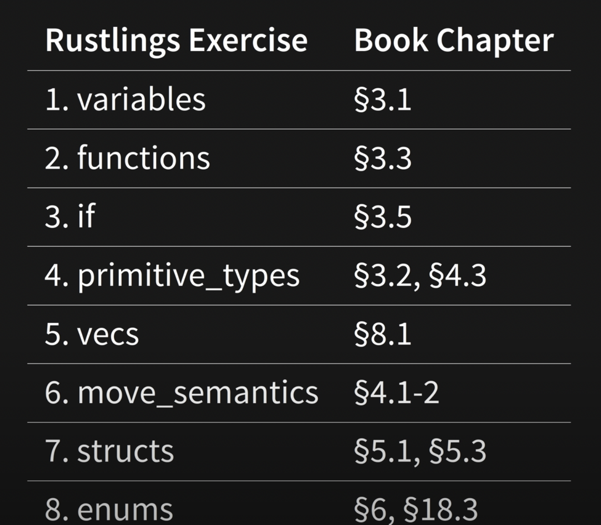

- How to learn rust \[[youtube](https://www.youtube.com/watch?v=2hXNd6x9sZs)\]
- The Rust Programming Language \[[pdf](https://lise-henry.github.io/books/trpl2.pdf)\]
    - Better (i.e. online) version found [here](https://doc.rust-lang.org/book/title-page.html). I started with the pdf version but I am liking this more.
- Rustlings \[[github](https://github.com/rust-lang/rustlings)\]

Use Rustlings exercise alongside chapters from the book. Install Rustlings according to the instructions in the Rustlings repo and run `rustlings` to access excercies.

(Taken from the video linked above)

Other resources
- [A Gentle Introduction to Rust](https://stevedonovan.github.io/rust-gentle-intro/)